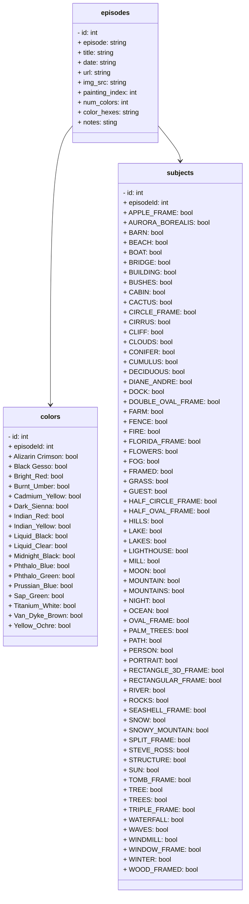

# Database structure
---

```mermaid
classDiagram
    class episodes {
       - id: int
       + episode: string
       + title: string
       + date: string
       + url: string
       + img_src: string
       + painting_index: int
       + num_colors: int
       + color_hexes: string
       + notes: sting
    }
    episodes --> colors
    class colors {
        - id: int
        + episodeId: int
        + Alizarin Crimson: bool
        + Black Gesso: bool
        + Bright_Red: bool
        + Burnt_Umber: bool
        + Cadmium_Yellow: bool
        + Dark_Sienna: bool
        + Indian_Red: bool
        + Indian_Yellow: bool
        + Liquid_Black: bool
        + Liquid_Clear: bool
        + Midnight_Black: bool
        + Phthalo_Blue: bool
        + Phthalo_Green: bool
        + Prussian_Blue: bool
        + Sap_Green: bool
        + Titanium_White: bool
        + Van_Dyke_Brown: bool
        + Yellow_Ochre: bool
    }
    episodes --> subjects
    class subjects {
        - id: int
        + episodeId: int
        + APPLE_FRAME: bool
        + AURORA_BOREALIS: bool
        + BARN: bool
        + BEACH: bool
        + BOAT: bool
        + BRIDGE: bool
        + BUILDING: bool
        + BUSHES: bool
        + CABIN: bool
        + CACTUS: bool
        + CIRCLE_FRAME: bool
        + CIRRUS: bool
        + CLIFF: bool
        + CLOUDS: bool
        + CONIFER: bool
        + CUMULUS: bool
        + DECIDUOUS: bool
        + DIANE_ANDRE: bool
        + DOCK: bool
        + DOUBLE_OVAL_FRAME: bool
        + FARM: bool
        + FENCE: bool
        + FIRE: bool
        + FLORIDA_FRAME: bool
        + FLOWERS: bool
        + FOG: bool
        + FRAMED: bool
        + GRASS: bool
        + GUEST: bool
        + HALF_CIRCLE_FRAME: bool
        + HALF_OVAL_FRAME: bool
        + HILLS: bool
        + LAKE: bool
        + LAKES: bool
        + LIGHTHOUSE: bool
        + MILL: bool
        + MOON: bool
        + MOUNTAIN: bool
        + MOUNTAINS: bool
        + NIGHT: bool
        + OCEAN: bool
        + OVAL_FRAME: bool
        + PALM_TREES: bool
        + PATH: bool
        + PERSON: bool
        + PORTRAIT: bool
        + RECTANGLE_3D_FRAME: bool
        + RECTANGULAR_FRAME: bool
        + RIVER: bool
        + ROCKS: bool
        + SEASHELL_FRAME: bool
        + SNOW: bool
        + SNOWY_MOUNTAIN: bool
        + SPLIT_FRAME: bool
        + STEVE_ROSS: bool
        + STRUCTURE: bool
        + SUN: bool
        + TOMB_FRAME: bool
        + TREE: bool
        + TREES: bool
        + TRIPLE_FRAME: bool
        + WATERFALL: bool
        + WAVES: bool
        + WINDMILL: bool
        + WINDOW_FRAME: bool
        + WINTER: bool
        + WOOD_FRAMED: bool
    }
```