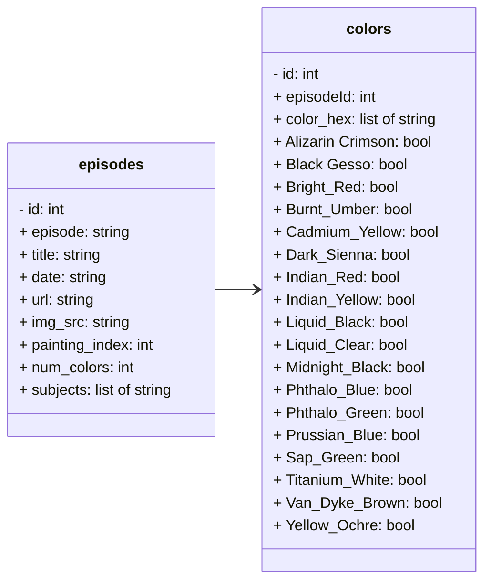

# Database structure
---

```mermaid
classDiagram
    direction LR
    class episodes {
       - id: int
       + episode: string
       + title: string
       + date: string
       + url: string
       + img_src: string
       + painting_index: int
       + num_colors: int
       + subjects: list of string
    }
    episodes --> colors
    class colors {
        - id: int
        + episodeId: int
        + color_hex: list of string
        + Alizarin Crimson: bool
        + Black Gesso: bool
        + Bright_Red: bool
        + Burnt_Umber: bool
        + Cadmium_Yellow: bool
        + Dark_Sienna: bool
        + Indian_Red: bool
        + Indian_Yellow: bool
        + Liquid_Black: bool
        + Liquid_Clear: bool
        + Midnight_Black: bool
        + Phthalo_Blue: bool
        + Phthalo_Green: bool
        + Prussian_Blue: bool
        + Sap_Green: bool
        + Titanium_White: bool
        + Van_Dyke_Brown: bool
        + Yellow_Ochre: bool
    }
```